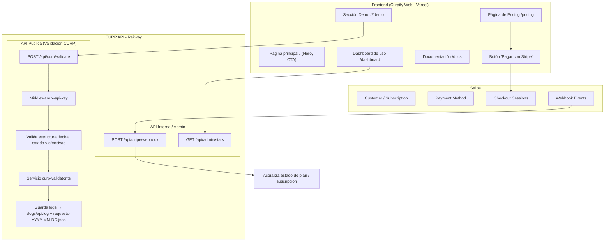

This is a [Next.js](https://nextjs.org) project bootstrapped with [`create-next-app`](https://nextjs.org/docs/app/api-reference/cli/create-next-app).

## Getting Started

First, run the development server:

```bash
npm run dev
# or
yarn dev
# or
pnpm dev
# or
bun dev
```

Open [http://localhost:3000](http://localhost:3000) with your browser to see the result.

You can start editing the page by modifying `app/page.tsx`. The page auto-updates as you edit the file.

This project uses [`next/font`](https://nextjs.org/docs/app/building-your-application/optimizing/fonts) to automatically optimize and load [Geist](https://vercel.com/font), a new font family for Vercel.

## Learn More

To learn more about Next.js, take a look at the following resources:

- [Next.js Documentation](https://nextjs.org/docs) - learn about Next.js features and API.
- [Learn Next.js](https://nextjs.org/learn) - an interactive Next.js tutorial.

You can check out [the Next.js GitHub repository](https://github.com/vercel/next.js) - your feedback and contributions are welcome!

## Deploy on Vercel

The easiest way to deploy your Next.js app is to use the [Vercel Platform](https://vercel.com/new?utm_medium=default-template&filter=next.js&utm_source=create-next-app&utm_campaign=create-next-app-readme) from the creators of Next.js.

Check out our [Next.js deployment documentation](https://nextjs.org/docs/app/building-your-application/deploying) for more details.

## Arquitectura de Curpify

# Curpify — API de Validación de CURP en Milisegundos

Curpify es una API ultra rápida y confiable para validar CURP en México.  
Diseñada para desarrolladores y empresas que necesitan validación inmediata para onboarding, KYC, formularios, procesos legales o automatizaciones internas.


## Rate limits

Curpify aplica límites por plan:

- Demo (sin API key): **5 requests por día** (por IP)
- Free: **50 requests por mes**
- Developer: **5,000 requests por mes**
- Business: **50,000 requests por mes**

## Errores comunes

### 401 Unauthorized
Cuando falta API key (y no aplica demo):
```json
{ "ok": false, "error": "Falta header x-api-key" }
## Rate limits

Curpify aplica límites por plan:

- Demo (sin API key): **5 requests por día** (por IP)
- Free: **50 requests por mes**
- Developer: **5,000 requests por mes**
- Business: **50,000 requests por mes**

## Errores comunes

### 401 Unauthorized
Cuando falta API key (y no aplica demo):
```
```json
{ "ok": false, "error": "Falta header x-api-key" }

### 400 Bad Request
Request inválido (payload mal formado o faltan campos): 
```
```json
{ "ok": false, "error": "Request inválido" }

## Autenticación (API Key)

Curpify usa API Keys vía header:

- Header: `x-api-key: curp_...
```

### Modos de uso
- **Demo (sin key):** permite validar con límite **5 por día por IP**.
- **Con API Key:** aplica rate-limit por plan (mensual) y habilita métricas/dashboard.

---

## Rate limits

| Plan | Límite |
|------|--------|
| Demo | 5 validaciones por día por IP |
| Free | 50 validaciones por mes por API key |
| Developer | 5,000 validaciones por mes por API key |
| Business | 50,000 validaciones por mes por API key |

> Si necesitas más volumen, contáctanos para plan a la medida. 
```

---

## Errores típicos

### 401 Unauthorized
**Falta API key** (cuando el modo demo no aplica al endpoint).
```json
{ "ok": false, "error": "Falta header x-api-key" }
```


---

## 🧠 Arquitectura General del Proyecto



